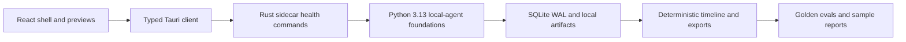

# Architecture

Initial Phase 0 placeholder. See `../plan.md` for the authoritative roadmap and constraints.

The planned architecture is:

```txt
React UI
  -> typed Tauri client
  -> Rust Tauri backend
  -> Python FastAPI sidecar
  -> SQLite WAL + local artifacts
  -> timeline engine
  -> reports/exports
```

Phase 0 does not implement this runtime yet. This file records the intended boundaries so future implementation issues do not mix UI, native commands, sidecar work, storage, and AI behavior in one change.

## Current implementation map



Implemented today:

- desktop shell and preview UI
- typed sidecar health checks
- Python FastAPI health foundation
- SQLite WAL migrations and repositories
- fake session validation and export
- deterministic timeline, Markdown export, and report foundations
- local model availability fallback states
- selective OCR/audio/embedding/vision contracts without real model loading
- workflow debugger rules, golden evals, and resource budget checks

Not implemented yet:

- live Windows recorder loop
- bundled Python sidecar installer
- production signing or updater
- real model runtime downloads
- end-to-end live capture demo
